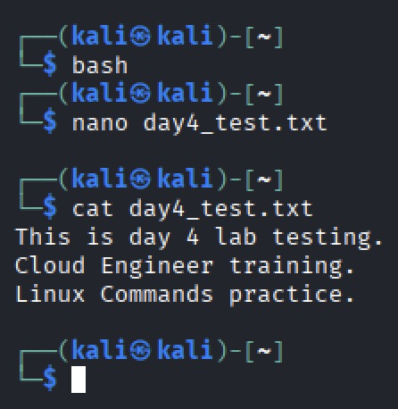
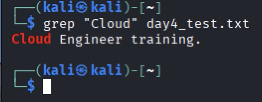
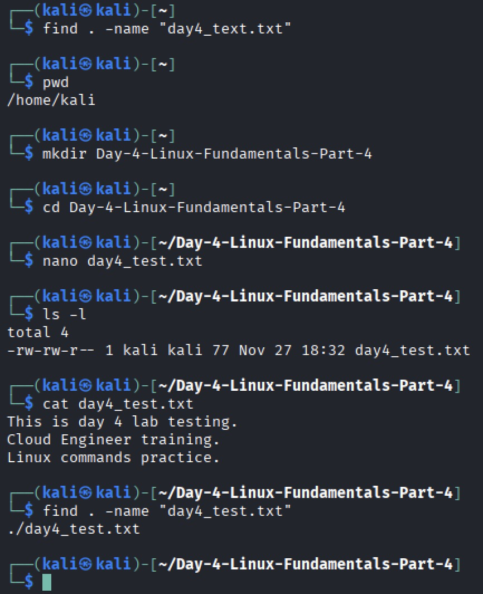
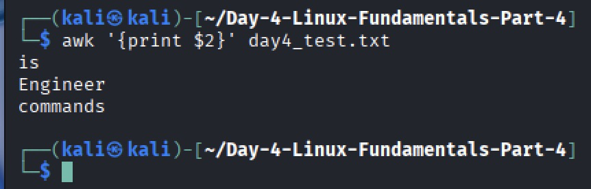

# Linux Fundamentals Part 4 — Day 4 Lab

## Overview
This lab focused on:
- Creating and editing files
- Searching text within files
- Finding files in directories
- Basic text manipulation with `awk`

---

## Screenshots & Notes

### 1. Create and verify a file

- Created `day4_test.txt` with `nano` and verified contents with `cat`.

### 2. Search for text inside a file

- Used `grep "Cloud" day4_test.txt` to locate text.

### 3. Find files in a directory

- Used `find . -name "*.txt"` to locate all `.txt` files. Went back and created folder once I realised there was no directory.

### 4. Text manipulation with awk

- Used `awk '{print $2}' day4_test.txt` to print the second word of each line.

---

## Key Takeaways
- Learned to create, edit, and verify files  
- Learned to search text and locate files efficiently  
- Learned to manipulate text using `awk`  
- Gained confidence with basic Linux command-line tools
