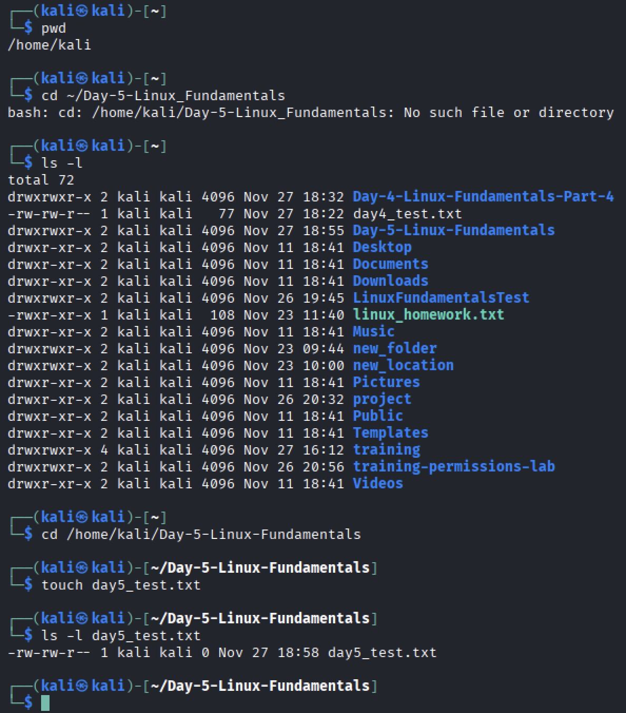
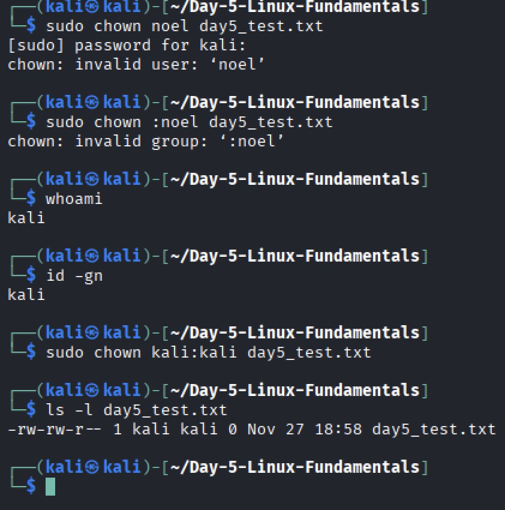
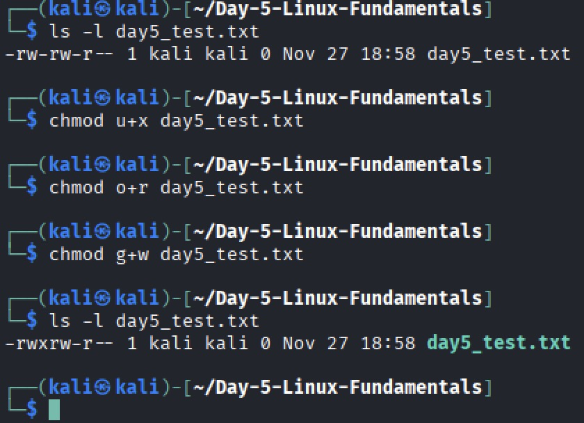
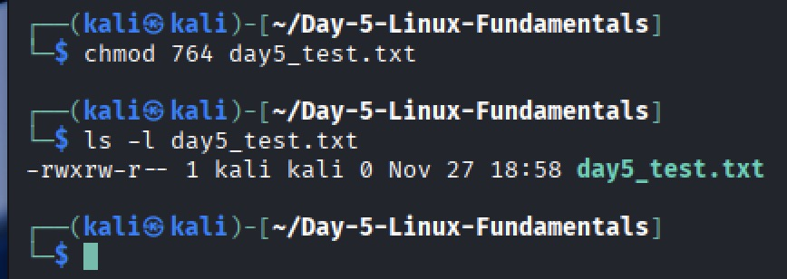

# Linux Fundamentals Part 5 — Day 5 Lab

## Overview
This lab focused on:
- Viewing file permissions
- Changing file ownership
- Modifying file permissions (symbolic and numeric)
- Understanding Linux permission structure

---

## Screenshots & Notes

### 1. Create and verify a file

- Created 'Day-5-Linux-Fundamentals' folder with 'mkdir'. Created `day5_test.txt` with `touch` and verified permissions with `ls -l`.

### 2. Change ownership

- Changed owner and group to `kali` using `sudo chown kali:kali day5_test.txt`. Attempted to change owner and group name to noel but was unsuccessful.

### 3. Change permissions (symbolic)

- Modified permissions using `chmod u+x`, `chmod o-r`, `chmod g+w`.
- Verified with `ls -l`.

### 4. Change permissions (numeric)

- Used `chmod 764 day5_test.txt` to demonstrate numeric permissions.

---

## Key Takeaways
- Learned to view and understand Linux file permissions  
- Learned to change file ownership safely  
- Learned to modify file permissions using symbolic and numeric modes  
- Gained confidence managing files in a multi-user environment
