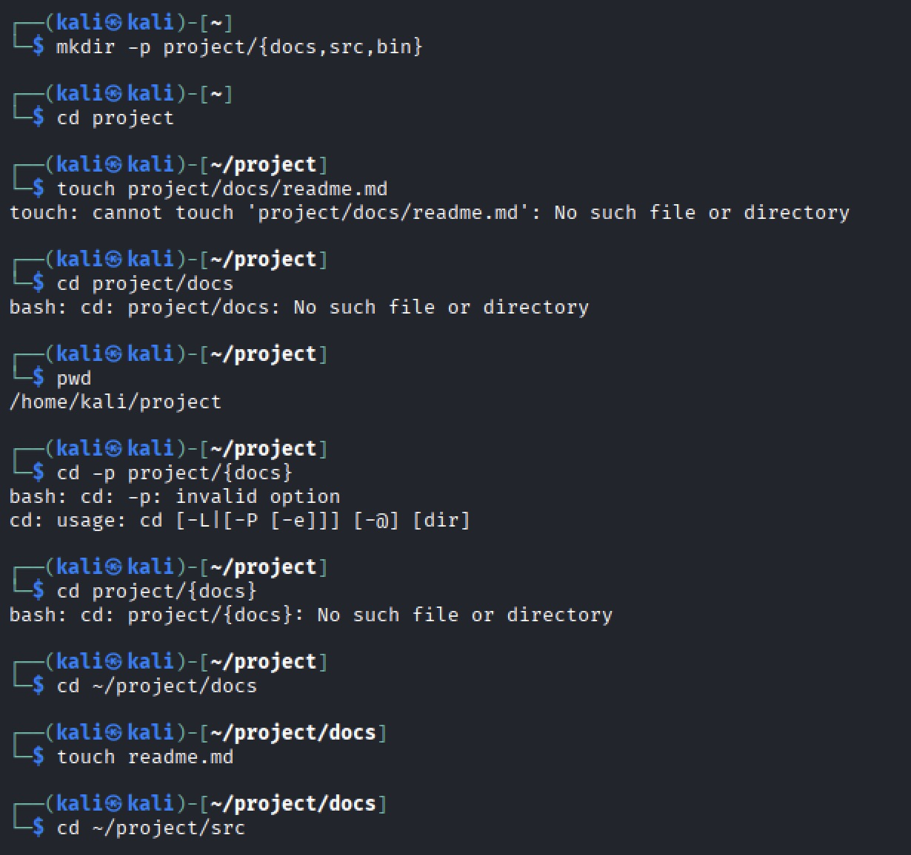
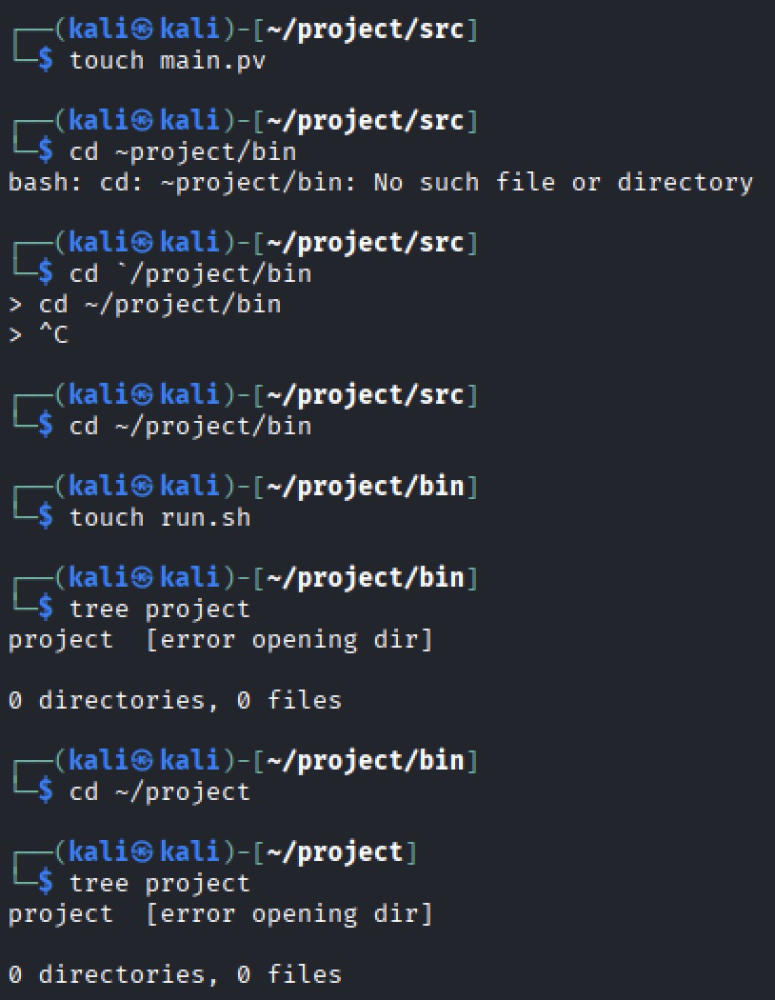
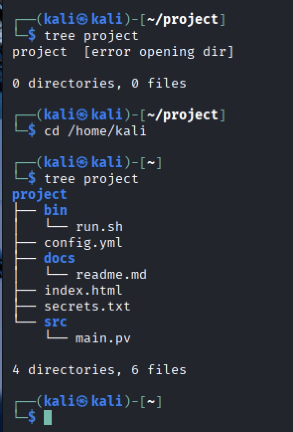
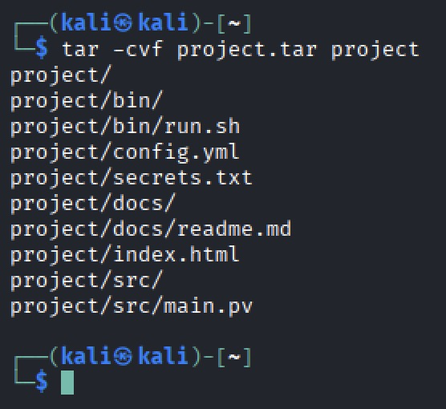
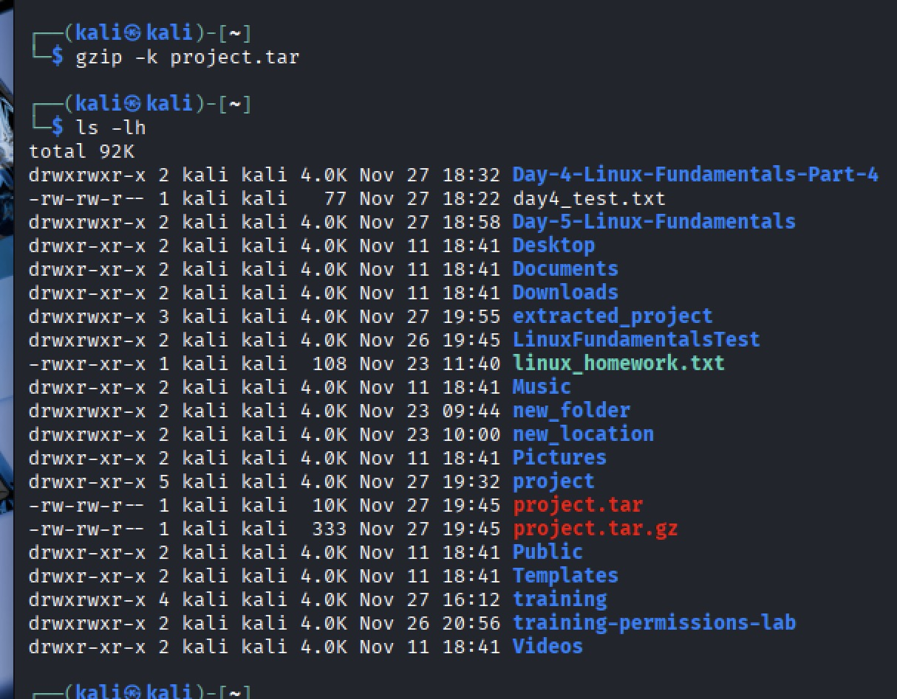
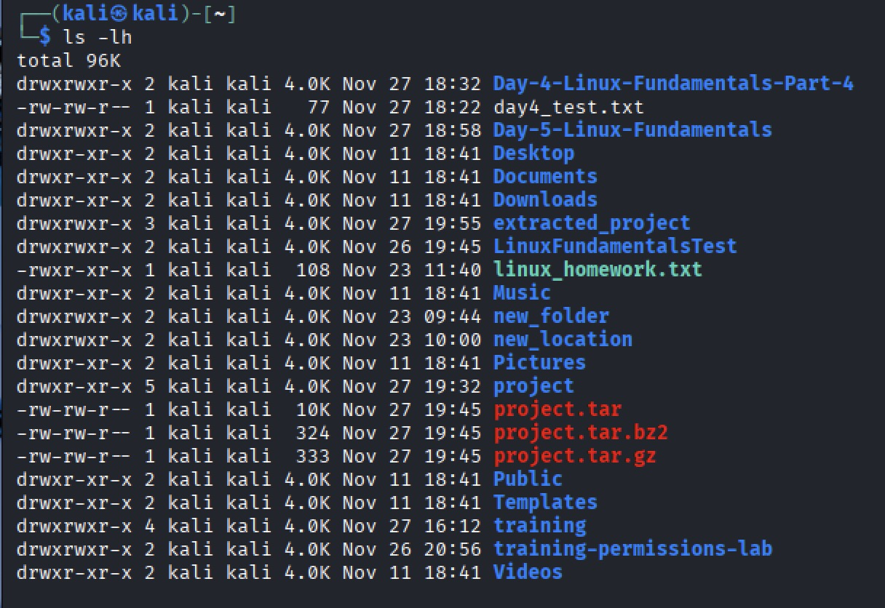
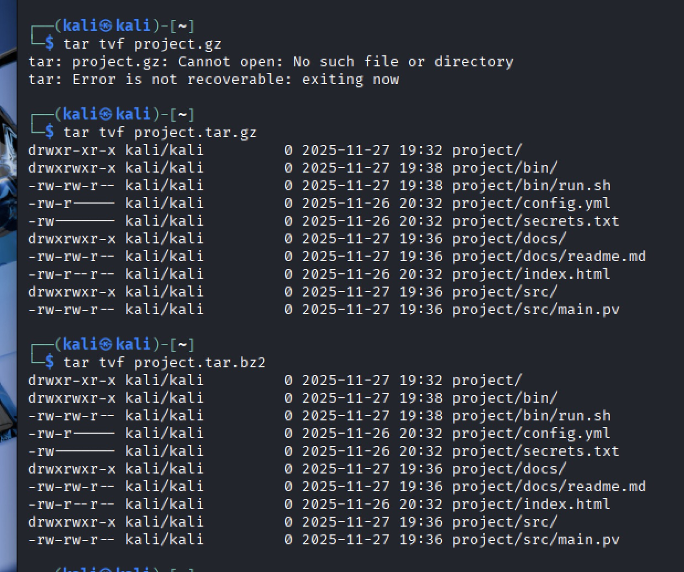

# Linux Fundamentals Part 6 — Day 6 Lab

## Overview
This lab focused on:
- Creating directories and organizing files
- Archiving files with `tar`
- Extracting archives
- Compressing archives using `gzip` and `bzip2`
- Verifying archive contents

---

## Screenshots & Notes

### 1. Create directories and test files

- Created `project` folder with `docs`, `src`, `bin` subfolders and test files.

### 2. Create tar archive

- Used `tar -cvf project.tar project` to archive files.

### 3. Verify tar archive contents

- Used `tar -tvf project.tar` to list contents.

### 4. Extract archive

- Created `extracted_project` and extracted archive with `tar -xvf project.tar -C extracted_project/`.

### 5. Compress with gzip

- Compressed archive to `project.tar.gz` using `gzip -k`.

### 6. Compress with bzip2

- Compressed archive to `project.tar.bz2` using `bzip2 -k`.

### 7. Verify Compressed Files

- Verified Compressed archive using `tar -tvf project.tar.gz` and `tar -tvf project.tar.bz2`.

## Key Takeaways
- Learned to organize files and directories efficiently  
- Learned to create and extract tar archives  
- Learned to compress archives with gzip and bzip2  
- Practiced verifying archive contents and structure
