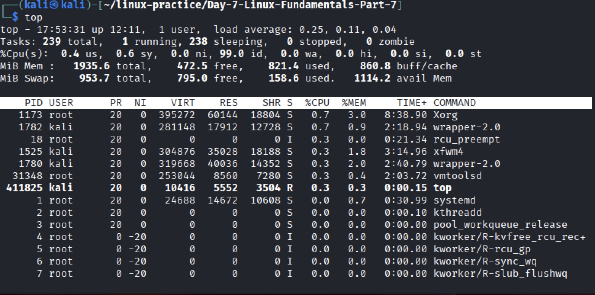
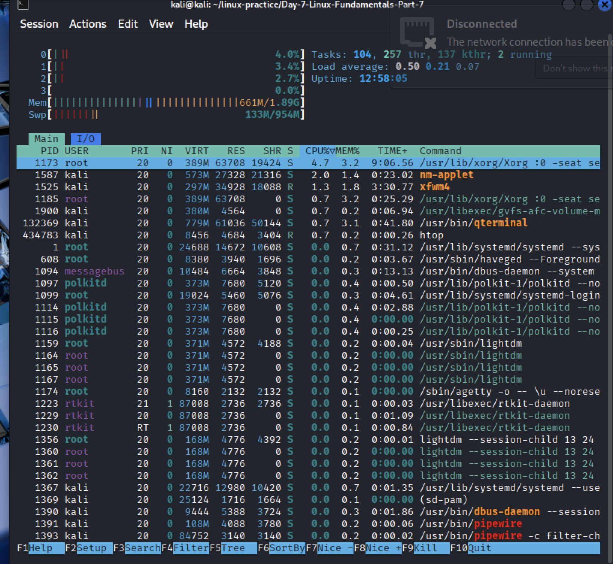
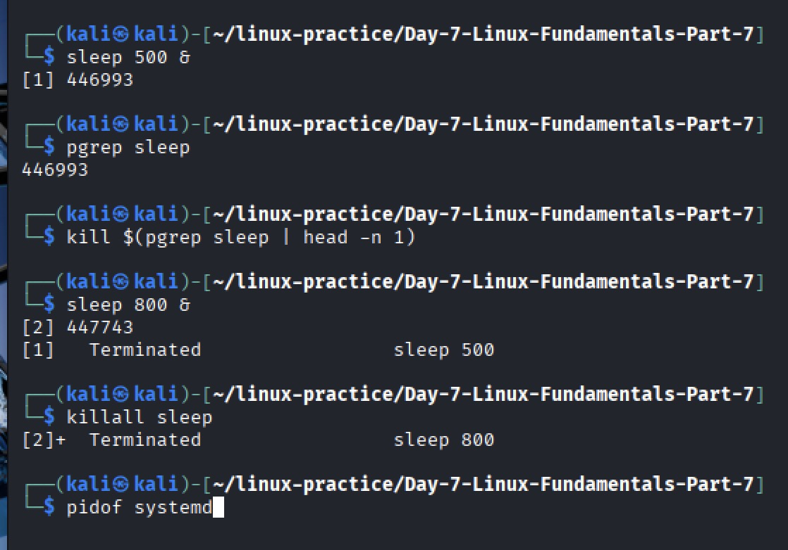
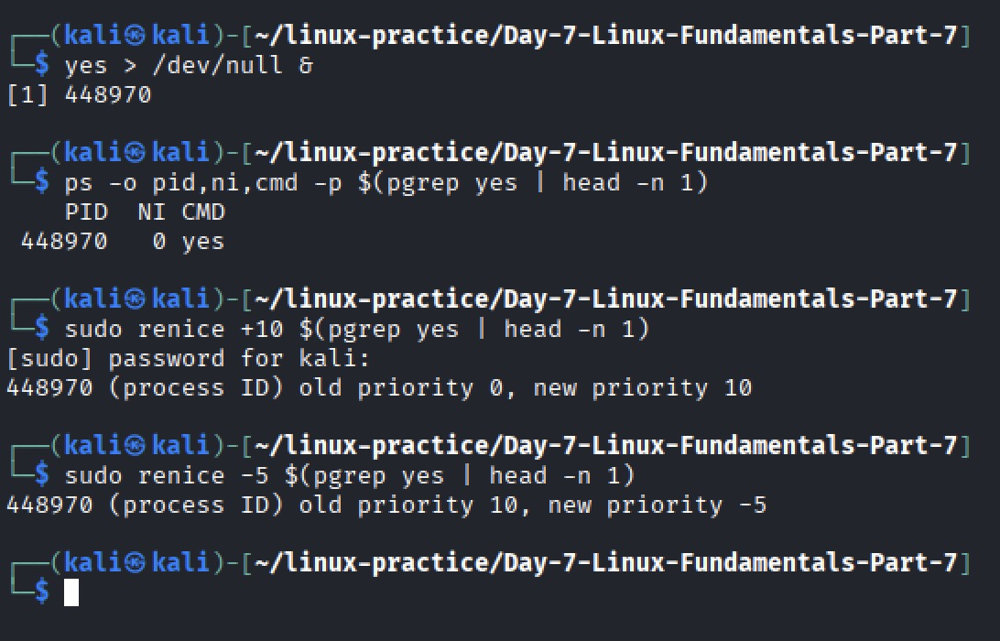

# Day-7 Linux Fundamentals Part 7 — Advanced Process Management

**Lab Folder:** `Day-7-Linux-Fundamentals-Part-7`
**Purpose:** Learn advanced process management in Kali Linux, including viewing, searching, terminating, and prioritizing processes.
All commands are Kali-safe — no syntax errors even if multiple or zero PIDs exist.

---

## Step 1 — View Running Processes

**Objective:** Learn to list processes and view them interactively.

**Basic process listing:**

```bash
ps aux
```

* Shows every process for all users with PID, CPU/memory usage, and command.

**Interactive real-time monitoring:**

```bash
top
```

* Press **q** to quit.

**Optional: If `htop` is installed:**

```bash
htop
```

* Easier to navigate and see CPU/memory usage visually.
* Use arrow keys to scroll and **F10** to quit.





---

## Step 2 — Search for Specific Processes

**Objective:** List and inspect processes safely.

**Commands:**

```bash
# List all bash processes
ps -ef | grep [b]ash

# Optional: Get only PIDs
pgrep bash

# Safely list details for all bash PIDs
pgrep bash | xargs -r ps -o pid,ppid,cmd -p

# Find PID of systemd
pidof systemd
```

**Explanation:**

* `ps -ef | grep [b]ash` lists running bash processes; `[b]ash` prevents grep from appearing.
* `pgrep bash` outputs all bash PIDs.
* `xargs -r ps -o pid,ppid,cmd -p` safely handles multiple or zero PIDs.
* `pidof systemd` finds the main systemd PID.


# Start another dummy process
sleep 800 &

# Kill all sleep processes
killall sleep
```



---

## Step 4 — Adjust Process Priorities

**Objective:** Change process priorities using nice values.

**Commands:**

```bash
# Start a CPU-intensive process
yes > /dev/null &

# Check current priority
ps -o pid,ni,cmd -p $(pgrep yes | head -n 1)

# Lower priority (increase nice value)
sudo renice +10 $(pgrep yes | head -n 1)

# Raise priority (decrease nice value)
sudo renice -5 $(pgrep yes | head -n 1)
```



---

## Step 5 — Section Complete

* All commands are **Kali-safe**, even with multiple or zero PIDs.
* Keep screenshots in the same folder for proper display in GitHub.

---

## **Screenshot Links for Browser (Markdown)**

```markdown


```

---

## GitHub Commit Reminder

From the repo root:

```bash
git add Day-7-Linux-Fundamentals-Part-7
git commit -m "Add Day-7 Section 1 lab with Step 1-4 and screenshots"
git push origin main
```

* Open GitHub in a browser to confirm screenshots render correctly.
* Each Day folder is standardized and self-contained.

