# Linux Fundamentals Part 8 — Day 8 Lab

## Overview

This lab focused on:

* Understanding systemd and managing services
* Checking service status and enabling/disabling services
* Reloading systemd daemon and managing custom services
* SSH key generation and passwordless login
* Securing SSH by disabling root login and password authentication
* Advanced SSH techniques: connecting to remote hosts, custom ports, and tunneling

---

## Screenshots & Notes

### 1. Understanding systemd

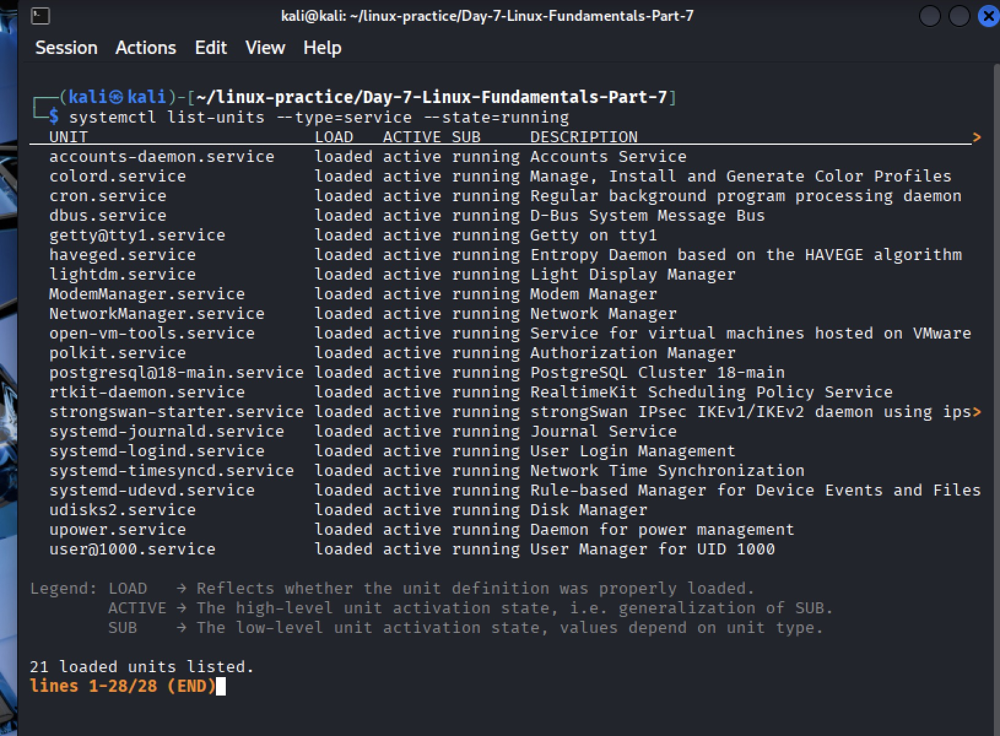

* Command: `systemctl list-units --type=service`
* **Explanation:** Lists all active systemd service units including their names, load state, active state, and description.
* **Outcome:** Verified which services are running under systemd.

### 2. Checking Service Status


* Command: `sudo systemctl status ssh`
* **Explanation:** Displays detailed cron service information (active state, main PID, logs).
* **Outcome:** Determined cron was enabled.

### 3. Enabling and Starting SSH Service


* Commands:

  ```bash
  sudo systemctl enable ssh
  sudo systemctl start ssh
  sudo systemctl reload ssh
  ```
* **Explanation:**

  * `enable` → SSH starts automatically at boot
  * `start` → starts SSH service immediately
* **Outcome:** SSH is running and enabled.

### 4. Verifying SSH Service

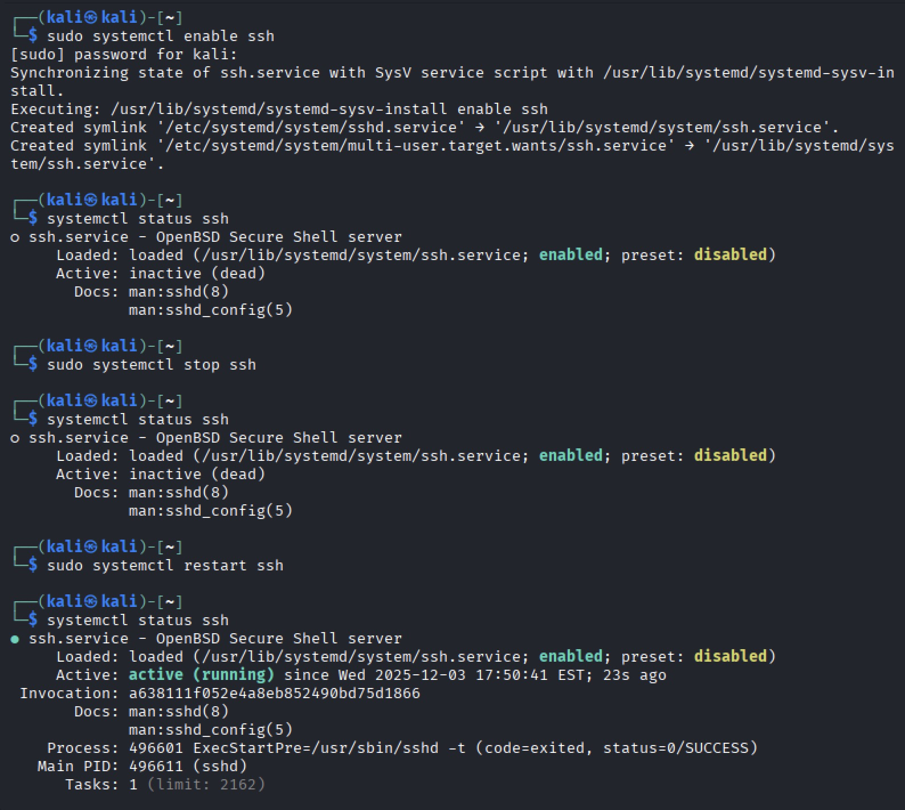

* Command: `sudo systemctl status ssh`
* **Explanation:** Confirms SSH service is active.
* **Outcome:** SSH shows `active (running)`.

### 5. Reloading systemd Daemon

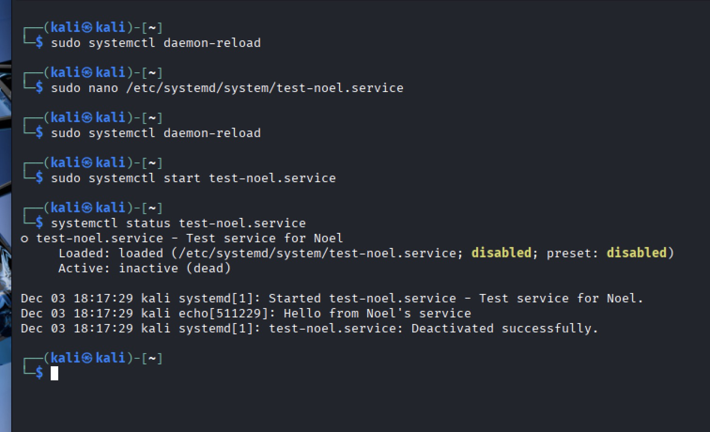

* Command: `sudo systemctl daemon-reload`
* **Explanation:** Reloads systemd manager configuration to recognize new or modified service files.
* **Outcome:** Systemd configuration updated and ready for custom services.

### 6. Enabling a Custom Service

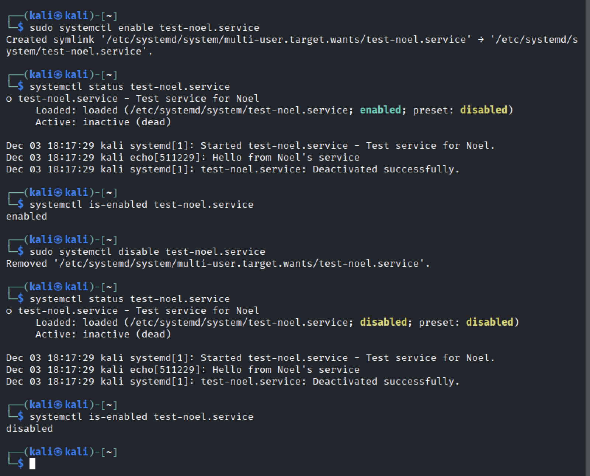
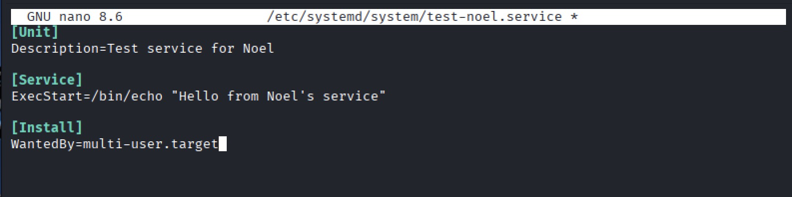

* Commands:

  ```bash
  sudo systemctl enable my-custom-service
  sudo systemctl start my-custom-service
  ```
* **Explanation:**

  * Enables a user-created or modified systemd service
  * Starts it immediately
* **Outcome:** Custom service is running and enabled at boot.

### 7. Viewing SSH Client Configuration


* Command: `cat ~/.ssh/config` (or `nano ~/.ssh/config`)
* **Explanation:** Allows checking or editing client-side SSH options like Host, Port, IdentityFile.
* **Outcome:** Verified SSH client configuration settings.

### 8. Connecting to a Remote Host with Key-Based Authentication

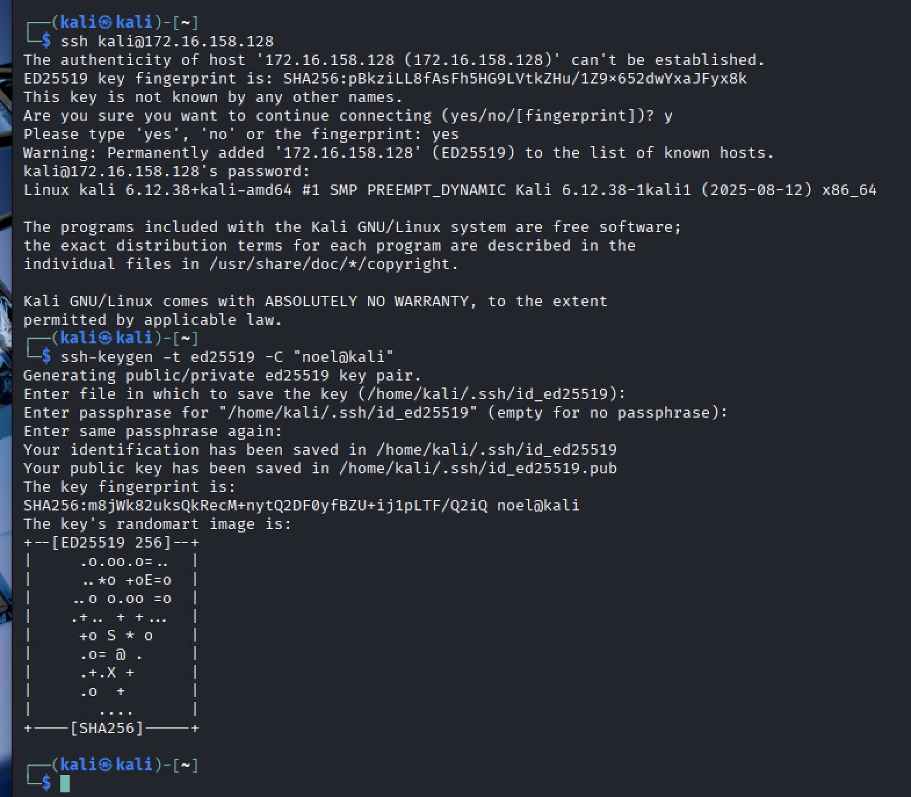

* Command: `ssh kali@172.16.158.128`
* **Explanation:** Connects to remote VM using SSH key authentication.
* **Outcome:** Successfully logged in without a password.

### 9. Securing SSH and Configuring Client Options

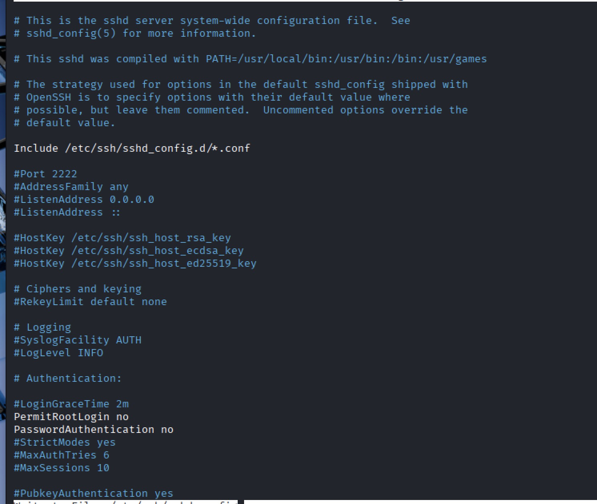
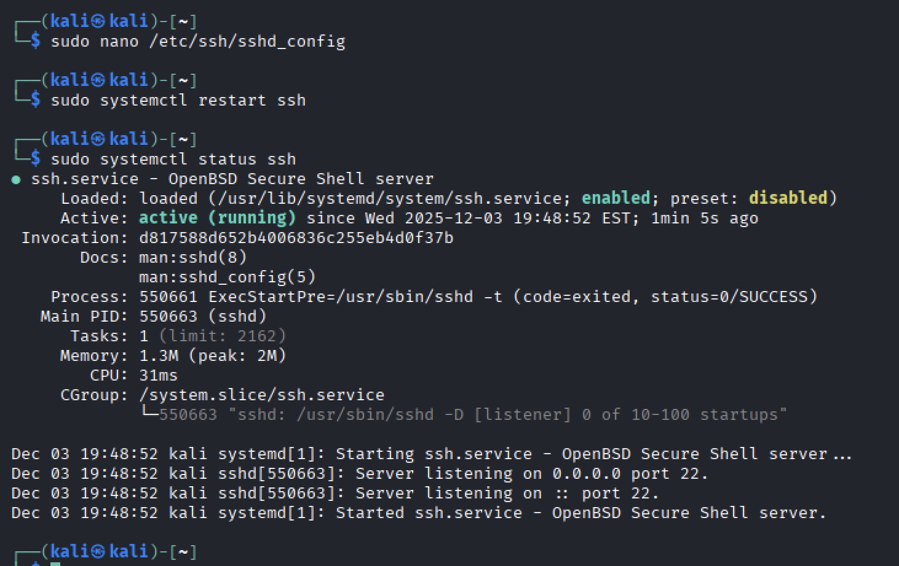
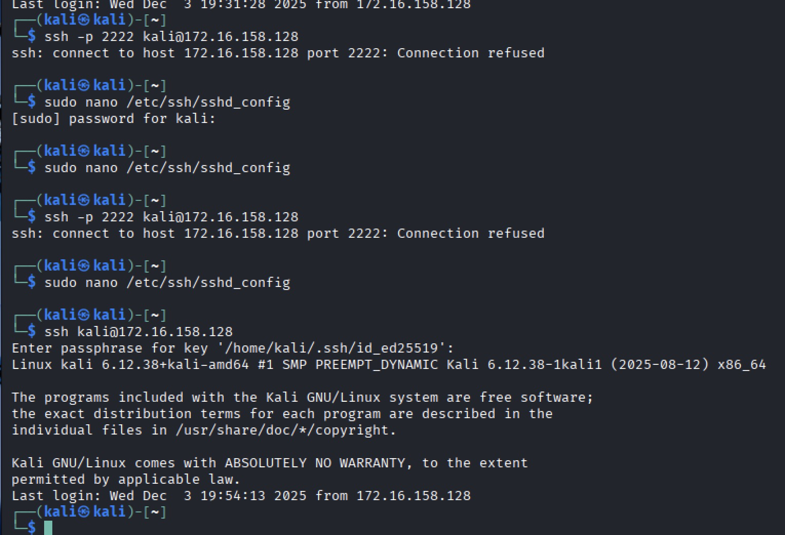

* Edited `/etc/ssh/sshd_config`:

  ```
  PermitRootLogin no
  PasswordAuthentication no
  ```
* Commands: `sudo systemctl restart ssh`
* **Explanation:**

  * Disables root login and password authentication for security
  * Restart applies the new SSH configuration
* **Outcome:** SSH access is now secure; only key-based logins allowed.

### 10. Advanced SSH Options and Tunneling

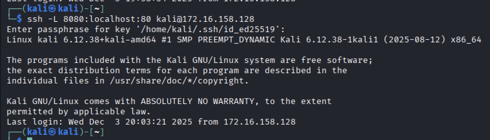

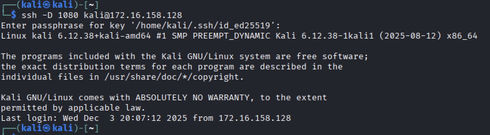

* Commands/examples:

  ```bash
  # Custom port
  ssh -p 2222 kali@172.16.158.128

  # Local port forwarding
  ssh -L 8080:localhost:80 kali@172.16.158.128

  # Remote port forwarding
  ssh -R 9090:localhost:3000 kali@172.16.158.128

  # Dynamic SOCKS proxy
  ssh -D 1080 kali@172.16.158.128
  ```
* **Explanation:**

  * Custom ports → connect using non-default SSH ports
  * Local forwarding → access remote services locally
  * Remote forwarding → expose local services to remote hosts
  * Dynamic SOCKS proxy → route traffic securely via SSH tunnel
* **Outcome:** Tested advanced SSH connections and tunneling.

---

## Key Takeaways

* Managed and verified systemd services including custom units.
* Reloaded systemd daemon to apply new configurations.
* Enabled, started, and confirmed SSH service operation.
* Generated SSH keys and configured passwordless login.
* Secured SSH by disabling root login and password authentication.
* Applied advanced SSH techniques: connecting with custom ports, local/remote port forwarding, and dynamic SOCKS proxy.
* Screenshots provide clear documentation for all steps and outcomes.

---


