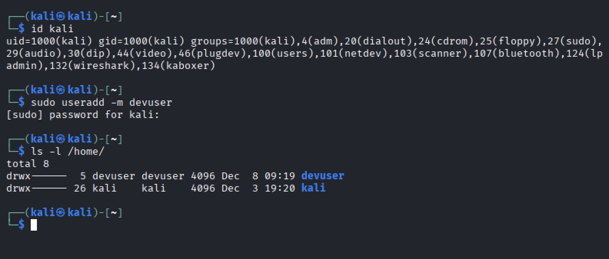
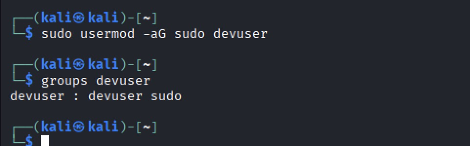
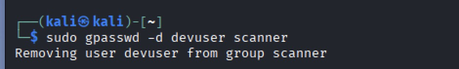
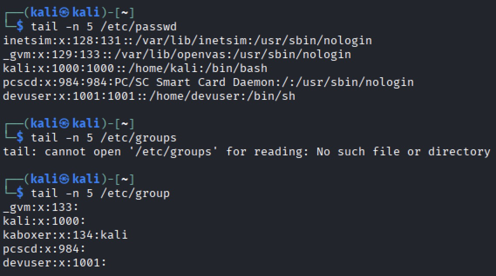
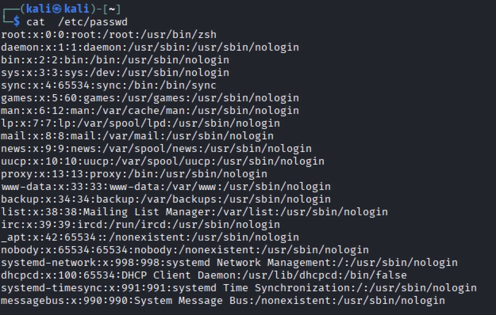
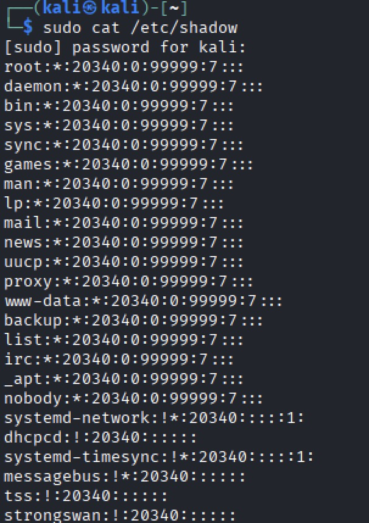
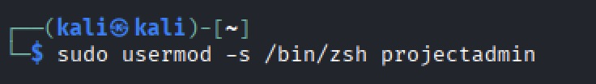
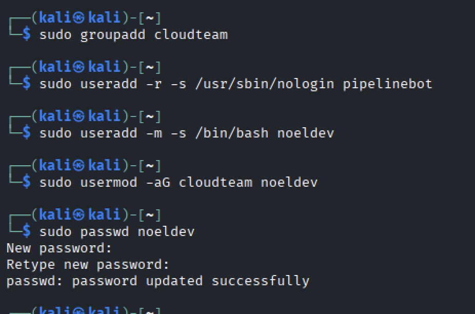
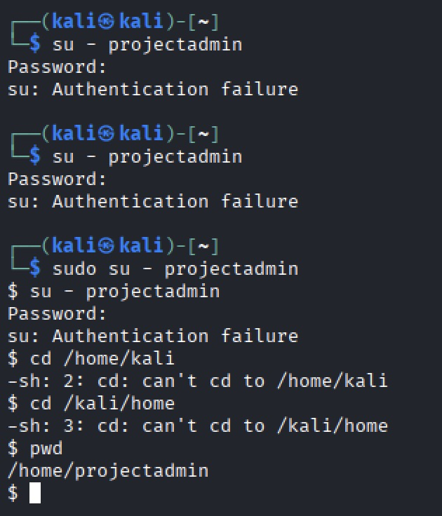

# Day 9 – Linux Fundamentals Part 9

## Overview

This lesson continues my Linux fundamentals journey, focusing on **Advanced Users & Groups**. All exercises are performed on a **Kali VM**.

## Commands & Explanations

### 1. Create a New User

```bash
sudo useradd -m devuser
```

* **Purpose:** Creates `devuser` with a home directory.
* **Verification:** `ls -l /home/`
* **Screenshot:** 

### 2. Add User to Group

```bash
sudo usermod -aG sudo devuser
```

* **Purpose:** Adds user to sudo group safely.
* **Verification:** `groups devuser`
* **Screenshot:** 

### 3. Add User to Multiple Groups

```bash
sudo usermod -aG docker,developers devuser
```

* **Purpose:** Bulk add groups.
* **Verification:** `groups devuser`
* **Screenshot:** 

### 4. Remove User from a Group

```bash
sudo gpasswd -d devuser docker
```

* **Purpose:** Safely remove group membership.
* **Verification:** `groups devuser`
* **Screenshot:** 

### 5. Inspect Accounts

```bash
tail -n 5 /etc/passwd
tail -n 5 /etc/group
```

* **Purpose:** Verify recent changes.
* **Screenshot:** 

### 6. View All Users

```bash
cat /etc/passwd
```

* **Purpose:** Understand system accounts.
* **Screenshot:** 

### 7. Inspect Shadow Passwords

```bash
sudo cat /etc/shadow
```

* **Purpose:** See encrypted passwords (root only).
* **Screenshot:** 

### 8. Modify Existing User

```bash
sudo usermod -aG developers projectadmin
```

* **Purpose:** Assign group membership.
* **Verification:** `id projectadmin`


### 9. Change User Shell

```bash
sudo usermod -s /bin/zsh projectadmin
```

* **Purpose:** Update default login shell.
* **Verification:** `/etc/passwd`
* **Screenshot:** 

## Hands-On Mini Lab

1. Create project group:

```
sudo groupadd cloudteam
```

2. Create system service account:

```
sudo useradd -r -s /usr/sbin/nologin pipelinebot
```

3. Create normal user and assign group:

```
sudo useradd -m -s /bin/bash noeldev
sudo usermod -aG cloudteam noeldev
```

4. Set passwords: `sudo passwd noeldev`
5. Switch to projectadmin: `sudo su - projectadmin`

**Screenshot Checkpoints:**

* 


## Troubleshooting

* `su - projectadmin` asks for password → set with `sudo passwd projectadmin`
* `sudo su - projectadmin` works but `su - projectadmin` does not → normal behavior, uses sudo privileges
* `useradd: command not found` → prefix with `sudo`
* User not showing groups → log out/in or `newgrp`
* Accidentally overwrote groups → restore from `/etc/group`
* * 

## Key Takeaways

* User and group management is core to Linux permissions.
* Always use `usermod -aG` for safe group assignment.
* `/etc/passwd`, `/etc/shadow`, `/etc/group` are essential for troubleshooting.
* Screenshot Checkpoints ensure GitHub documentation is complete.

---

**GitHub folder:** `day-9-linux-fundamentals-part-9`
