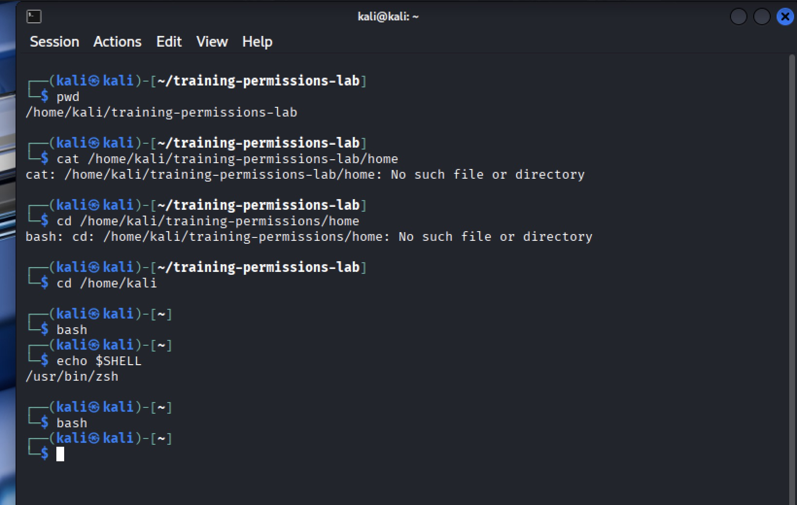
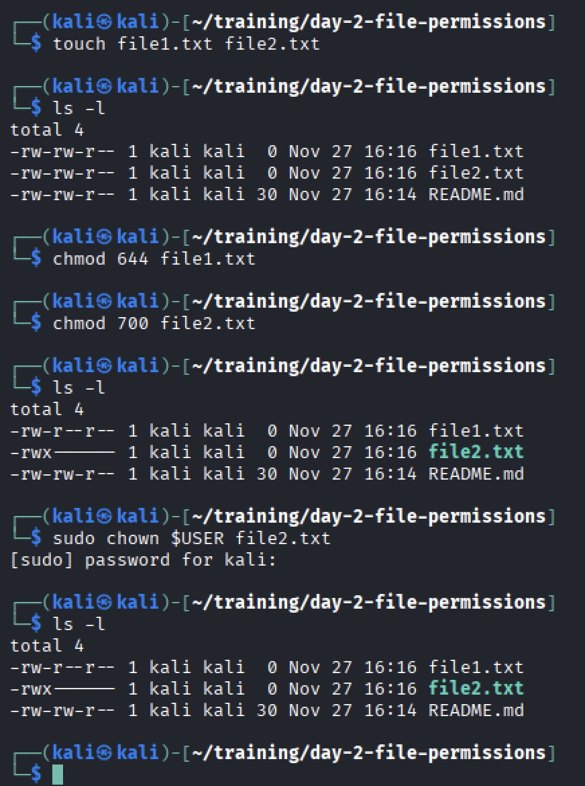

# Linux Fundamentals Part 2 — Day 2 Lab

## Overview
This lab focused on:
- File permissions
- Ownership changes
- Using chmod, chown
- Understanding octal vs symbolic permissions
- Verifying permission changes

---

## Screenshots & Explanations

### 1. Screenshot – Terminal Verification

**What did I observe?**  
I checked I was in the correct file path using the cd command to navigate. I ensured I was using bash using the bash command. 

### 2. Screenshot – Created New Directory and File

**Used mkdir, cd and nano:**  
Continued to make myself comfortable with these basic commands.

### 3. Screenshot – Created New Files and Changed Permissions and Ownership

**What changed?**  
Created new .txt files using touch command. Checked files using ls -l command. Changed file permissions using chmod commands with appropriate permission codes. Changed ownership using sudo and chown commands. Checked files once altered with ls -l.

---

## Key Takeaways
- What permissions mean  
- How symbolic vs octal modes work  
- What each command does  

