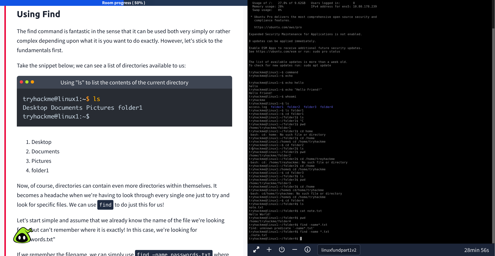
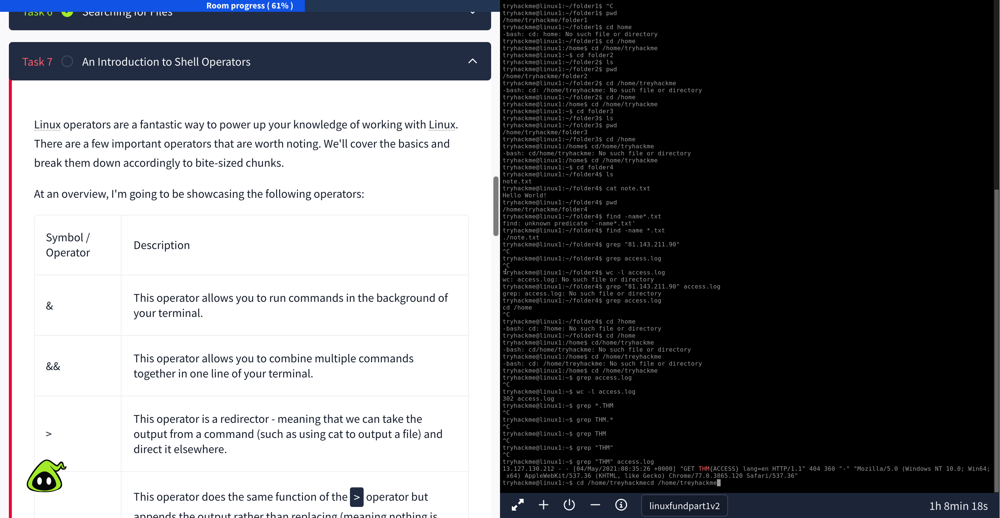
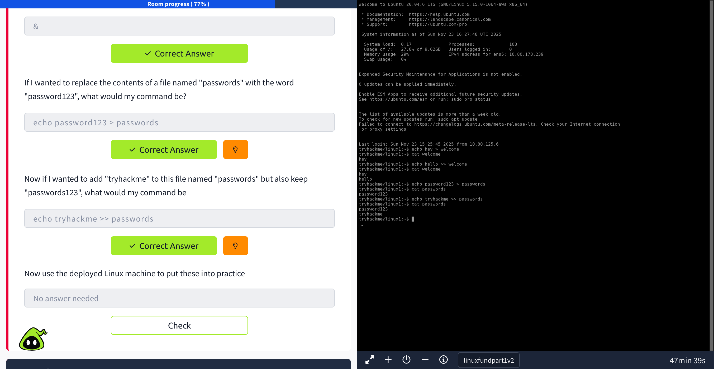

# Linux Fundamentals 1 — Lab Write-Up

This lab covered the basics of navigating the Linux file system, using essential commands, editing files, checking permissions, and understanding system structure.

---

## 🔍 Objectives
- Learn core Linux navigation commands  
- Work with files and directories  
- Modify and inspect file permissions  
- Edit text files with nano  
- Understand the Linux file system hierarchy  

---

## 📸 Screenshots

| Step | Screenshot |
|------|------------|

---

## 🧠 Key Takeaways
- Linux is case-sensitive  
- `ls -l` reveals powerful information (permissions, owners, file types)  
- Nano is simple but extremely useful  
- The file system hierarchy (`/etc`, `/usr`, `/home`) makes everything predictable  

---

## 🔧 Commands I Used
See: [commands.md](./commands.md)

---

## 🧭 Reflection
This lab helped reinforce the fundamentals of Linux navigation and file management. I feel more confident with basic commands and understanding where system files live.
